*****************************************
FLAT User Guide
*****************************************

========
Login
========

When you open FLAT, you will be presented a login screen. This is where you
enter your username and password, as well as select what *configuration* you
want to use. FLAT supports multiple *configurations*, which allows
for using the same FLAT installation for multiple annotation projects, choose
the configuration that corresponds to your project.

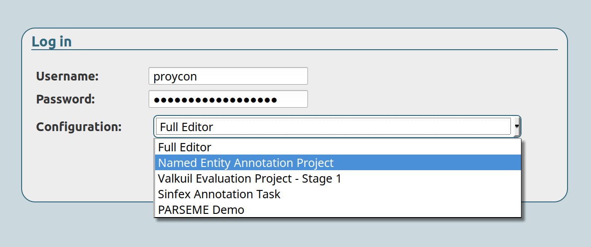

The login form may or may not offer an option to register a user account, if
you do not have one yet.

===================
Document Index
===================

After logging in, you will see an index of all your documents, organised into
folders and possibly subfolders. By default, there will be one folder
corresponding to your username. This is your personal workspace.

You can select a file to load it into the tool, this will usually present you
the annotation editor.

You may also see directories of others if the administrators have given you
explicit rights to do so. Moreover, if you have sufficient permission, you will
see tools to copy/move/delete selected documents.

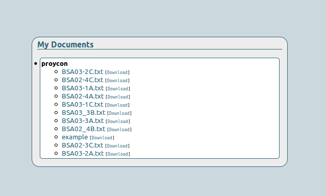

---------------------
Upload document
---------------------

You can upload FoLiA documents by clicking the **Upload document** button and selecting a local file to upload. Note
that only `FoLiA <https://proycon.github.io/folia/>`_ documents are supported, a very specific file format for
linguistic annotation. The administration guide provides some pointers on how to get your input converted to FoLiA.

Administrators may have disabled this functionality.

===================
Modes
===================

FLAT supports various modes that determines what tools you are presented. Often
the default mode is the annotation editor, but there is also a viewer (with no
edit functionality), a simple metadata editor and a structure editor (still under
development). You may switch modes in the menu:

.. image:: menu_modes.png
    :alt: Modes in FLAT
    :align: center

Administrators determine what modes are available in your configuration.

=======================
Annotation Viewer
=======================

The annotation viewer shows a FoLiA document and all of its linguistic
annotations. You will see the text of the document and find that you can hover
over all the words and elements to see more detailed information about them.

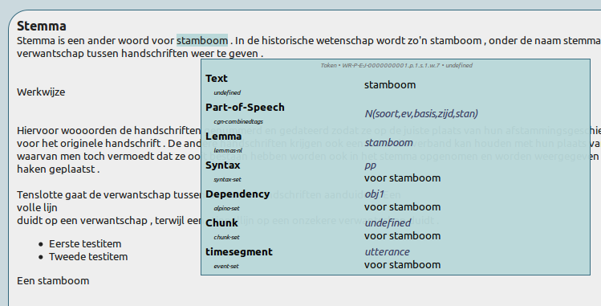

Viewing a document seems trivial, but it is a bit more involved,
as FLAT allows to fine-tune precisely what annotations you want to see.

The information you see when hovering over elements can be switched on and off
in the **Local annotations** menu, each annotation type is a toggle that turns
green when enabled. The administrators usually have configured sane defaults,
so you will not have to go here often.

To see linguistic information without needing to hover over elements, you can enable the
toggles in the **Global annotations** menu. In the following screenshot we
enabled lemmas and part of speech tags:

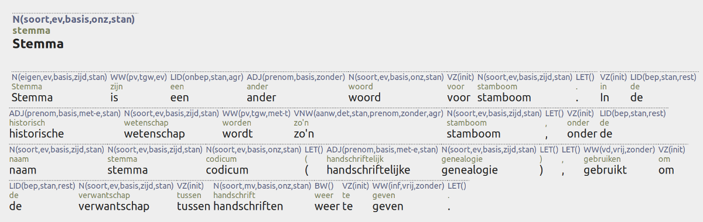

And this shows a representation for dependency relations (purple) and syntactic/constituency parses (blue):

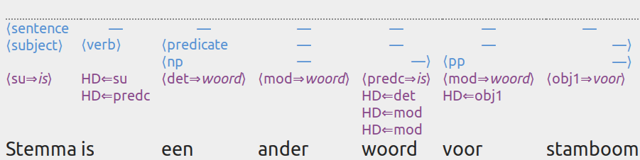

Last, but not least is the **Annotation Focus** menu. Here you can select a
single annotation type that is the focus of your attention. The various classes
of this annotation type in the text will then be coloured and a legend appears
on the left side of the document. An example for part-of-speech tags:

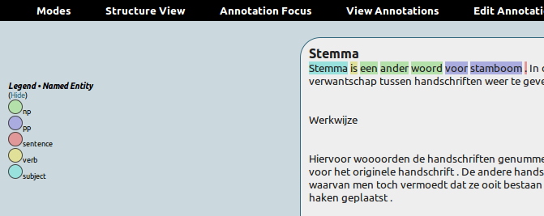

And for a shallow parse/chunking:

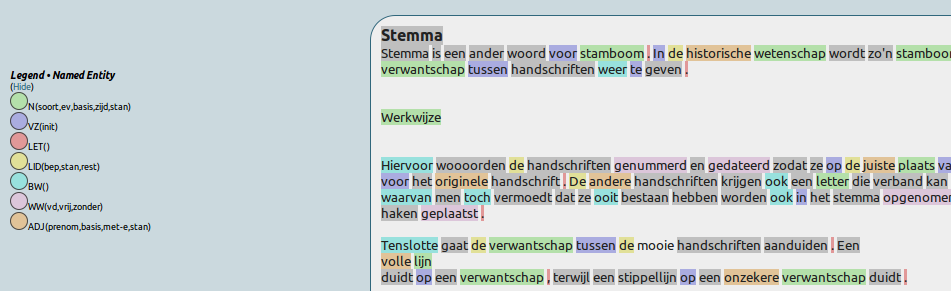

--------------
Perspectives
--------------

FLAT allows, depending on your configuration, for different *perspectives* on
your document. A perspective determines what structural elements you see, and
how much of them you see. The broadest perspective is the *document*
perspective, which simply shows the whole document, provided it is not too
large. Other perspectives can be the *paragraph* or *sentence* perspective,
showing only these elements. For documents with a large number of paragraphs or
sentences, you can page over multiple pages.

On the left-hand side of the screen, you can choose the perspectives that
administrators have predefined for you:

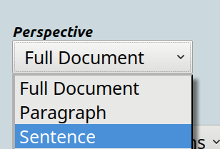

The pager is shown below the perspective selector, once you have selected a
pagable perspective. In the following example, a sentence perspective is
selected. You will notice that the sentences are now visually separated and
lightly boxed:

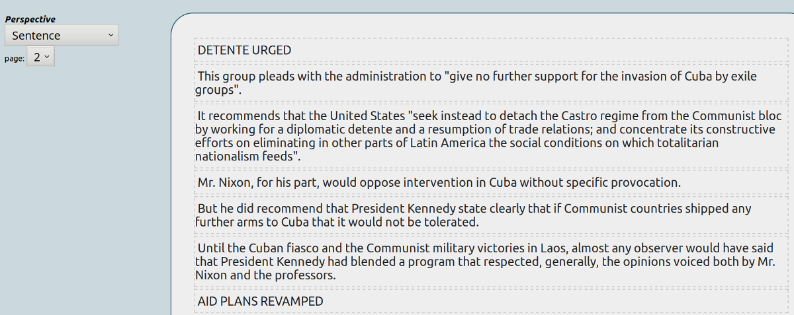

A special perspective, available only on documents properly segmented into
divisions, is offered in the same menu by means of a table of contents.

--------------------
Tools and Options
--------------------

The **Tools & Options** menu offers extra facilities for viewing. You can for
instance enable the toggle **Show annotator details** to show who annotated a
particular annotation when you hover over it, and when exactly this was done.

~~~~~~~~~
Search
~~~~~~~~~

You can access the search function through the **Tools & Options** menu. The search dialog allows you to enter complex
queries using CQL, the `Corpus Query Language <https://www.sketchengine.eu/documentation/corpus-querying/>`_, or FQL, the
`FoLiA Query Language <https://folia.readthedocs.io/en/latest/fql.html>`_ .

CQL, is considerably more concise than FQL, already well-spread, and its syntax is
easier. FQL has more FoLiA-specific features.

A CQL query consists of a match on one or more tokens, each token is represented by square brackets::

    ["to"] ["be"] ["or"] ["not"] ["to"] ["be"]

You can use ``[]`` as a wildcard match on any token::

    ["to"] [] ["or"] ["not"] ["to"] []

Rather than matching word forms, you can also match on linguistic annotations, such as for example lemmas, as follows::

    [lemma="to"] [lemma="be"] [lemma="or"] [lemma="not"] [lemma="to"] [lemma="be"]

You can match on any annotation type FoLiA supports (simply use the names of the corresponding folia tags). To be
compatible with existing CQL systax, the attribute ``tag`` maps to ``pos``, and ``word`` maps to ``text``.

If you match on word forms only, you can simply leave out the square brackets::

    "to" "be" "or" "not" "to" "be"

FLAT supports a subset of CQL:

* Operators for attribute matching (``>``, ``<``, ``!=``, ``=``)
* The following regular expression operators for token matching: ``[]*`` (zero or more) , ``[]+`` (one or more) and ``[]?`` (one or zero) and the interval expression: ``[]{x,y}`` where x and y are numbers (e.g. ``[]{1,4}``).
* Regular expression syntax in value matching (following Python's regular expression syntax), for example: ``"to" "be"
  "or" "n?t" "to" "be"``
* Intersections using ``&``, for example: ``[ lemma="be" & pos="V" ]``

Other more advanced features are not available.

=======================
Annotation Editor
=======================

The annotation editor builds upon the viewer discussed in the previous section
and adds advanced editing facilities. Make sure you are familiar with the
viewer already.

Annotation is always initiated by clicking on a word you want to annotate,
which will subsequently turn bright yellow. If
you want to annotate a span of multiple words, start by just clicking on the
first one. This will open the **Annotation Editor dialog**, as shown below:

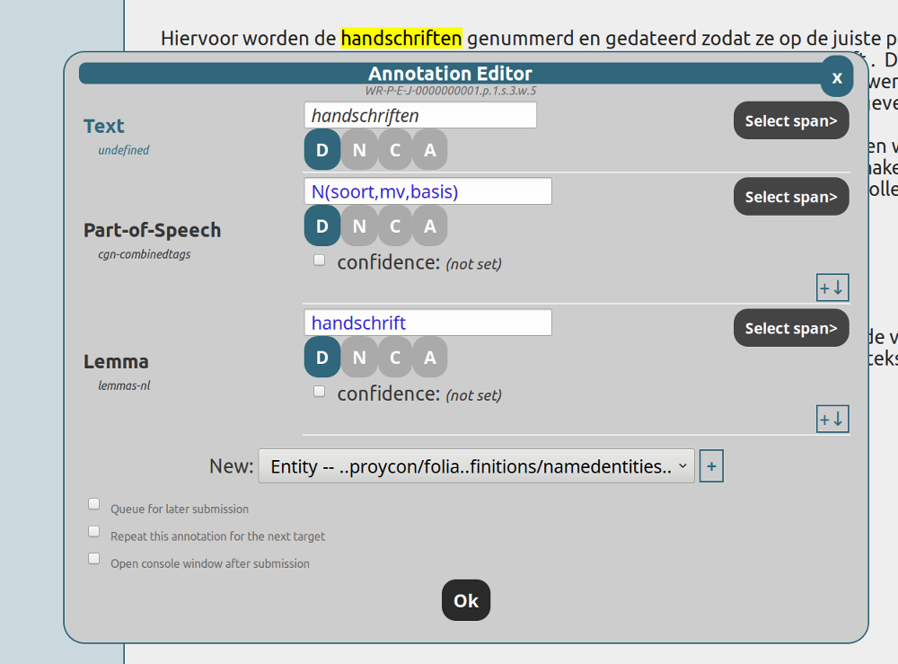

The editor dialog shows annotations that are relevant for the word you clicked
on, each annotation type and set on one row, which annotations are shown
exactly is determined by the various toggles in the **Editor annotations**
menu. The administrator is responsible for choosing sane defaults so you need
not worry about this usually.

The actual annotation may be a FoLiA *class* value (in blue text), such as a label
from a part-of-speech tagset, or it can be textual content (in black text). For
the former, the value may either be free-fill (as in the image above) or selectable from a pull down
list in case a closed set is defined (as in the image below).  Note that if you
want to *delete* an annotation, simply clear the class or text field (remove
the existing value or select an empty value).

Many annotation types span over multiple words. Examples are named entities,
syntax, chunks, etc...  To apply your annotation over multiple words, press the
**select span** button for the corresponding annotation (each has their own
button), and subsequently click on the words in the document that you want to
include in the span. They too will turn yellow. The following screenshot
illustrates this for named entity annotation from a closed set:

.. image:: spanselect.png
    :alt: Span selection from a closed set.
    :align: center

If you are modifying an existing annotation that spans multiple words, it will
be highlighted when you press **select span** and you can modify the span by
clicking words to add or remove them from the span. Selecting spans that are
not continuous is also allowed in this fashion.

For each row in the editor dialog, you may see several small buttons with
capital letters D,N,C or A, these represent the various **edit forms** that are
enabled, and will be discussed in aiseparate subsection below.

You can also assign a **confidence value**, expressing the confidence you as annotator hold in the
particular annotation you are making. This is set by ticking the checkbox before confidence and
moving the slider that appears on a scale from 0% confidence to 100% confidence.

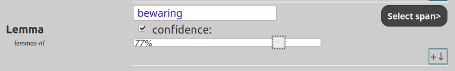

When you are done with adding or editing annotations, press the **Ok** button to submit your result.

------------------------
Adding new annotations
------------------------

Whenever you click a word and an **Annotation focus** is set in the menu,
empty fields will automatically be created in the editor to allow you to add an
annotation of that type. In other cases, you may add fields by explicitly by
selecting  an annotation type and set in the **New** box at the bottom of the editor dialog and
subsequently pressing the **+** button:

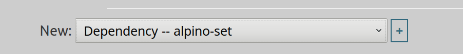

The new annotations in this list are annotations of a type and set that is already declared to be used in the document. If you want to add
a whole new annotation type and set that has not been used at all yet, you need
to *declare* it by clicking the **Tools & Options** menu and choosing **Add new
Annotation Type**. It will open a dialog that allows you to select the
annotation type and asks you for a URL to your FoLiA set definition:

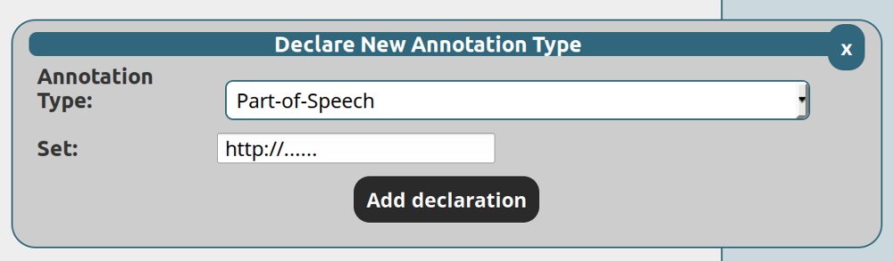

--------------
Edit Forms
--------------

When annotating, there are four different edit forms:

* **Direct editing** -- This is the simplest edit form, it either adds a new annotation or edits an existing annotation.
* **New annotation** -- This edit form is used when you want to explicitly add a new annotation rather than edit an existing annotation of the same type. It is used when defining overlapping spans for the same annotation type.
* **Correction** -- This edit forms introduces a correction of the annotation, the original version will be preserved and marked as corrected. When this edit form is choosen a field will appear to choose the class for the correction, indicating what type of correction it is.
* **Alternative** -- This edit form marks an annotation as alternative, meaning it is not the primary authoritative annotation.

The edit forms are represented by options buttons with a capital letter, only one of
them can be activated:

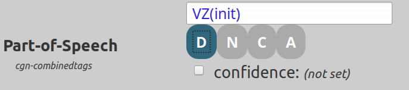

Which edit forms are available is determined by the administratori, as well as
by the toggles in the **Edit form** menu.

-------------------------
Higher order annotations
-------------------------

FLAT allows you to put annotations on annotations. A notable example is the
ability to assign arbitrary human readable comments or descriptions with any
annotation. In order to add such an annotation, access the higher order
annotation menu on the right of every annotation:

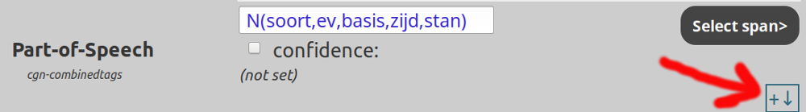

Selecting an option from the menu will add fields for a higher order annotation of the
specified type:

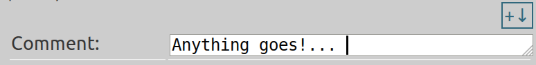

A common type of higher-order annotation is **features**, which allow you to associated classes with subsets and provide
additional detail on the annotation. They can be used with almost any annotation type.

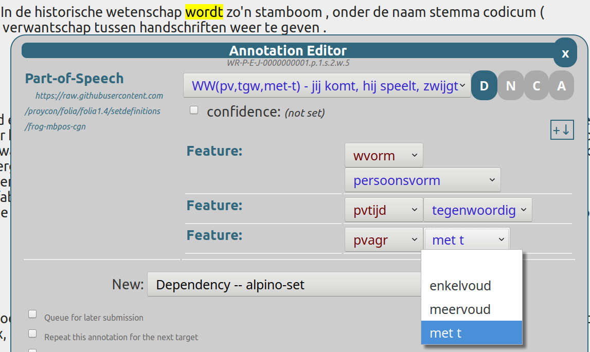

**Relations** are another form of higher-order annotation. Relations link arbitrary annotations to either outside resources,
or to other annotations in the FoLiA document. They can be used on almost any annotation type. Relations take a class
describing the nature of the relation (which is defined by whatever set you decide to use). External relations take a
URL to the external resource and optionally an indication of the format the external resource is in (a MIME Type). For
internal relations, these fields remain empty, but you add one or more **link references**.

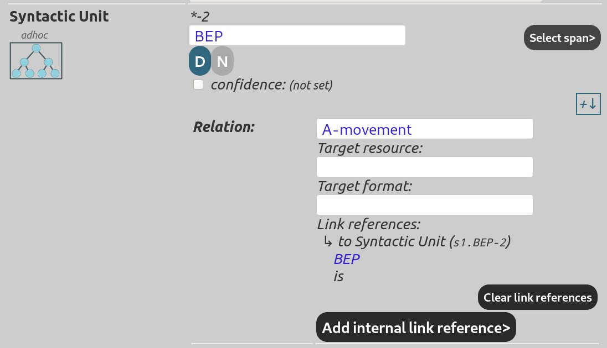

Adding a link reference is
done by clicking the button, and subsequently the word and annotation you mean to link to. Clicking a token will open a
new dialog populated with link buttons in the form of a yellow crosshair:

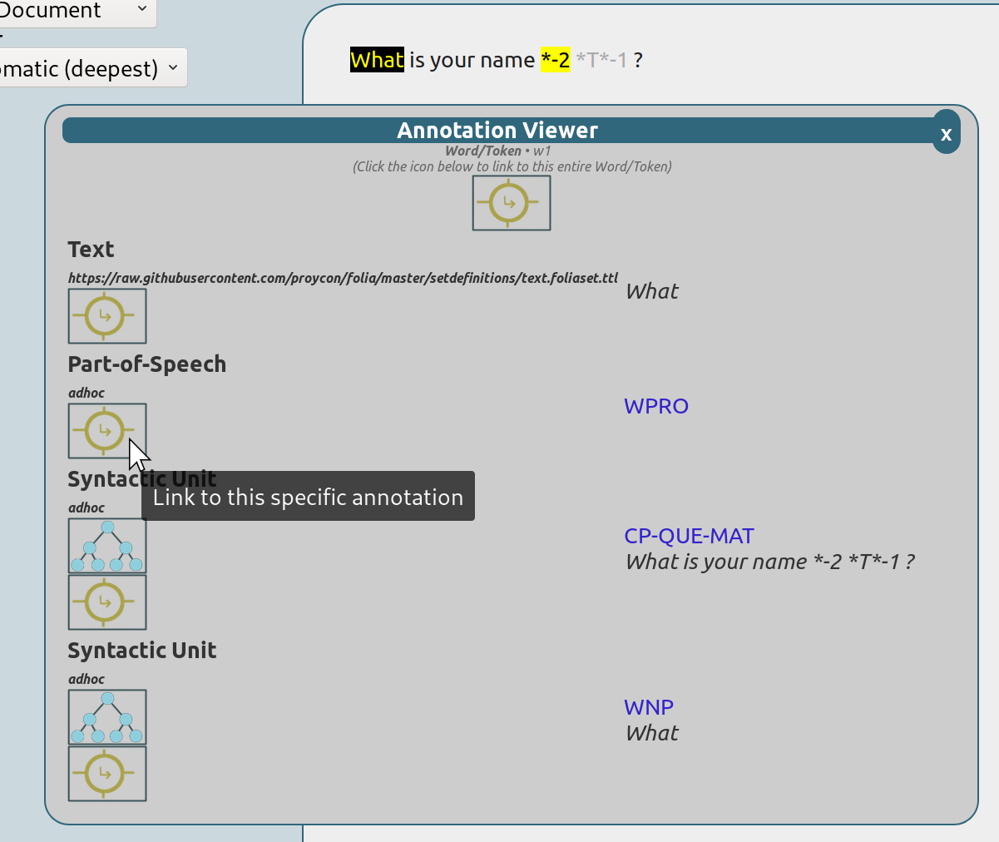

The centered link button at the top can be used to link to the structural element as a whole rather than a specific annotation inside
it.

------------------------------------------------------------------
Queued submissions, Repeated Annotations, and the Query Console
------------------------------------------------------------------

When you press **Ok** in the edit dialog, any changes you made will be
submitted to the server immediately, unless you tick the option **Queue for
later submission**.

Queuing submissions allows you to circumvent the typical 1-2 second delay that
is inherent in communication with the server, saving precious time if you are
doing fast-paced annotation. When an annotation is queued, the word it covers
will be highlighted in red. A new button for submission appears on the right
side of the screen:

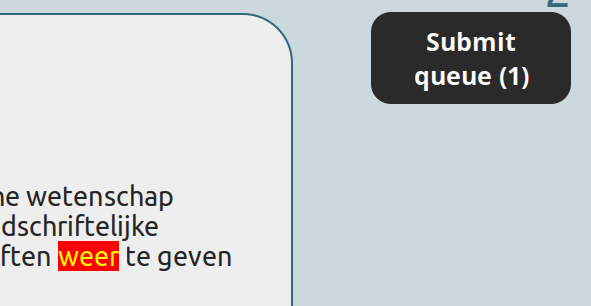

Do be aware that if you neglect to submit the annotations you delayed, or close
your browser, they will be lost!

In addition to queued submissions, the editor dialog also has an option
**Repeat this annotation for the next target**, which you can tick. If you do
so, the next time you click a word, the edit dialog will auto-fill the fields
in the same way as you did manually the first time. The only thing left to do
is to click the Ok button. In combination with queued submission, this offers a
powerful solution for fast-paced annotation.

Last, but not least, we want to introduce the **Query Console**, for advanced
users. This is accessible through the **Tools & Options** menu and will show
all queued submissions in the FoLiA Query Language (FQL). Highly technical
users may be pleased to hear that all operations in the interface are
translated to FQL to be sent to the server, and you are free to compose your
own FQL queries manually as well. The syntax is described as part of the `FoLiA
documentation <https://proycon.github.io/folia>`_.

------------------------------
Versioning (History & Undo)
------------------------------

(TODO: yet to be written)

=======================
Metadata Editor
=======================

(TODO: yet to be written)

